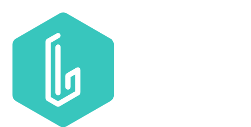

# Learnist

A learnist is an all in one open source platform to manage your studies, homeworks, etc.

## Features

- 🚀 Open Source
- 🌐 Easy to use
- 🕶️ Dark mode
- 💻 Cross platform

> Made as part of the Hashnode x PlanetScale Hackathon

## Badges

## Roadmap

- Teacher Accounts

- Integration between student and teacher Accounts

- Timers

- Better Dashboard

- and much more...
## Tech Stack

**Client:** NextJS, TailwindCSS

**Server:** FastAPI, [PlanetScale](https://planetscale.com)
## Authors

- [@ax-a-dev](https://www.github.com/ax-a-dev)

## License

[MIT](https://choosealicense.com/licenses/mit/)

